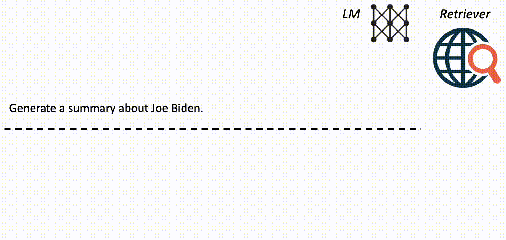

# <ins>F</ins>orward-<ins>L</ins>ooking <ins>A</ins>ctive <ins>RE</ins>trieval augmented generation (FLARE)

This repository contains the code and data for the paper
[Active Retrieval Augmented Generation](https://arxiv.org/abs/2305.06983).

## Overview

FLARE is a generic retrieval-augmented generation method that actively decides when and what to retrieve using a prediction of the upcoming sentence to anticipate future content and utilize it as the query to retrieve relevant documents if it contains low-confidence tokens.

<p align="center">
  
</p>

## Install environment with Conda
Create a conda env and follow `setup.sh` to install dependencies.

## Quick start

### Download Wikipedia dump
Download the Wikipedia dump from [the DPR repository](https://github.com/facebookresearch/DPR/blob/main/dpr/data/download_data.py#L32) using the following command:
```shell
mkdir data/dpr
wget -O data/dpr/psgs_w100.tsv.gz https://dl.fbaipublicfiles.com/dpr/wikipedia_split/psgs_w100.tsv.gz
pushd data/dpr
gzip -d psgs_w100.tsv.gz
popd
```

### Build Wikipedia index
We use Elasticsearch to index the Wikipedia dump.
```shell
wget -O elasticsearch-7.17.9.tar.gz https://artifacts.elastic.co/downloads/elasticsearch/elasticsearch-7.17.9-linux-x86_64.tar.gz  # download Elasticsearch
tar zxvf elasticsearch-7.17.9.tar.gz
pushd elasticsearch-7.17.9
nohup bin/elasticsearch &  # run Elasticsearch in background
popd
python prep.py --task build_elasticsearch --inp data/dpr/psgs_w100.tsv wikipedia_dpr  # build index
```

### Setup Bing search
This is only required for experiments on the WikiASP dataset.
1. Create a bing search API key following instructions on [https://www.microsoft.com/en-us/bing/apis/bing-web-search-api](https://www.microsoft.com/en-us/bing/apis/bing-web-search-api).
2. Run a local bing search server with caching functionality to save credits: `export BING_SEARCH_KEY=$YOUR_KEY; python bing_search_cache_server.py &> bing_log.out &`.

### Setup OpenAI keys
Put OpenAI keys in the `keys.sh` file.
Multiple keys can be used to accelerate experiments.
Please avoid uploading your keys to GitHub by accident!

### Run FLARE
Use the following command to run FLARE with `text-davinci-003`. 
```shell
./openai.sh 2wikihop configs/2wikihop_flare_config.json  # 2WikiMultihopQA dataset
./openai.sh wikiasp configs/wikiasp_flare_config.json  # WikiAsp dataset
```
Be careful, experiments are relatively expensive because FLARE calls OpenAI API multiple times for a single example. You can decrease `max_num_examples` to run small-scale experiments to save credits.
Set `debug=true` to active the debugging mode which walks you through the iterative retrieval and generation process one example at a time.

## Citation
```
@article{jiang2023flare,
      title={Active Retrieval Augmented Generation}, 
      author={Zhengbao Jiang and Frank F. Xu and Luyu Gao and Zhiqing Sun and Qian Liu and Jane Dwivedi-Yu and Yiming Yang and Jamie Callan and Graham Neubig},
      year={2023},
      eprint={2305.06983},
      archivePrefix={arXiv},
      primaryClass={cs.CL}
}
```
